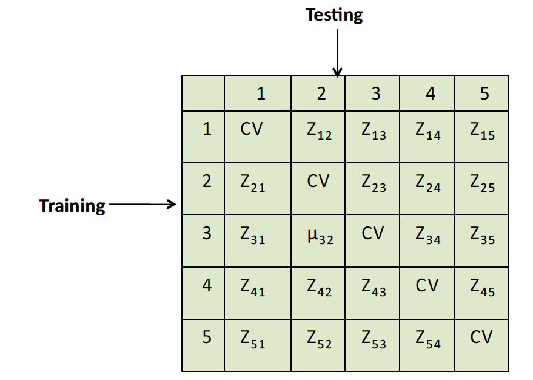
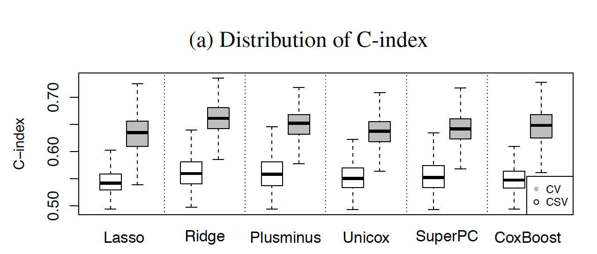
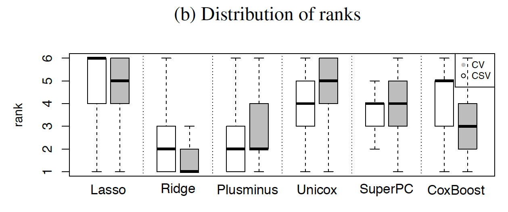

### Purpose

This paper was written by Christoph Bernau et. al. and appeared in _Bioinformatics_ in 2014. The main goal of the paper was to develop and implement a replacement approach to cross-validation when evaluating high-dimensional prediction models in independent data sets, since cross-validation within exemplary data sets may not adequately reflect performance when applied to other, independent data sets. This is especially needed for biomedical applications where samples orginate from different institutions using different equipment and processing methods.

It has been found that accuracy estimates of genomic prediciton models based on independent validation data are substantially inferior to cross-validation metrics. In some cases, this is due to the incorrect application of cross-validation. However, even correctly performed cross-validation may not avoid over-optimism resulting from potentially unknown sources of heterogeneity across data sets.

> "These include differences in design, acquisition and ascertainment strategies, hidden biases, technologies used for measurements, and populations studied. In addition, many genomics studies are affected by experimental batch effects. Quantifying these heterogenities and describing their impact on the performance of prediction algorithms is critical in the practical implementation of personalized medicine procedures that use genomic information."

### What consitutes as a 'good' learning algorithm?
There are potentially conflicting perspectives on this. 

1. Algorithms that are _specialist_, meaning they perform well when trained and applied to a single population and experimental setting, but not expected to perform well when the resulting model is applied to different populations and settings.

2. Algorithms that are _generalist_, meaning they may be suboptimal for the training population, but perform reasonably well across different populations and laboratories.

### Methods

#### Notation

Data sets: $i= 1, ... , I$

Sample sizes: $N_1, ... , N_I$

Observations: a primary outcome $Y^s_i$ (possibly censored survival time) and a vector of predictor variables $X^s_i$

Algorithms: $k= 1, ... , K$

Matrix of scores: $\textbf{Z}^k$
    * The $(i,j)$ element in the matrix measures how well the model produced by algorithm $k$ trained on data set $i$ performs when validated on data set $j$. 
    * The diagonal entries are obtained via 4-fold CV in each data set
    * Possible definition for the scores include the concordance (C-index), AUC, $R^2$, etc., depending on the type of data 
    * They use the C-index since they are analyzing time to event data
    
#### Summarization of CSV Matrix

The goal is to evaluate and rank competing prediction methods. However, since the ranking may depend on the application, the first step is to define the prediction task of interest. They focus on the
prediction of metastasis-free survival time in breast cancer patients based on high-throughput gene-expression measurements.

In order to rank learning algorithms $k = 1, ..., K$, they summarize each $\textbf{Z}^k$ by a single score. They have 2 approaches for scores:

1. The _Simple Average_ of all non-diagonal elements of tge $\textbf{Z}^k$ matrix:

\begin{equation}
\overline{CSV} = \frac{\sum_i \sum_{i \neq j}\textbf{Z}^k_{i,j}}{I(I-1)}
\end{equation}

2. The _Median_ or more generally a _quantile_ of the non-diagonal entries of $\textbf{Z}^k$. Quantiles offer robustness to outlier values, and the possibility to reduce the influence of those studies that are consistently associated with poor validation scores, both when used for training and validation, and independently of the learning algorithm. 

### Results

Below are plots showing a comparison of CSV and CV on simulated data. Each panel represents
evaluations of $K = 6$ algorithms across 1000 simulations of a
compendium of $I = 8$ datasets. For each simulation the diagonal or
off-diagonal elements of the $\textbf{Z}^k$ matrix of validation C-statistics is summarized
by (A) mean and (B) rank of the mean across algorithms. CV
estimates tend to be much higher than the CSV estimates. In most of the
simulations Lasso is ranked as one of the worst algorithms, both by CV
and CSV, while Ridge and Plusminus are ranked among the best prediction
methods.

